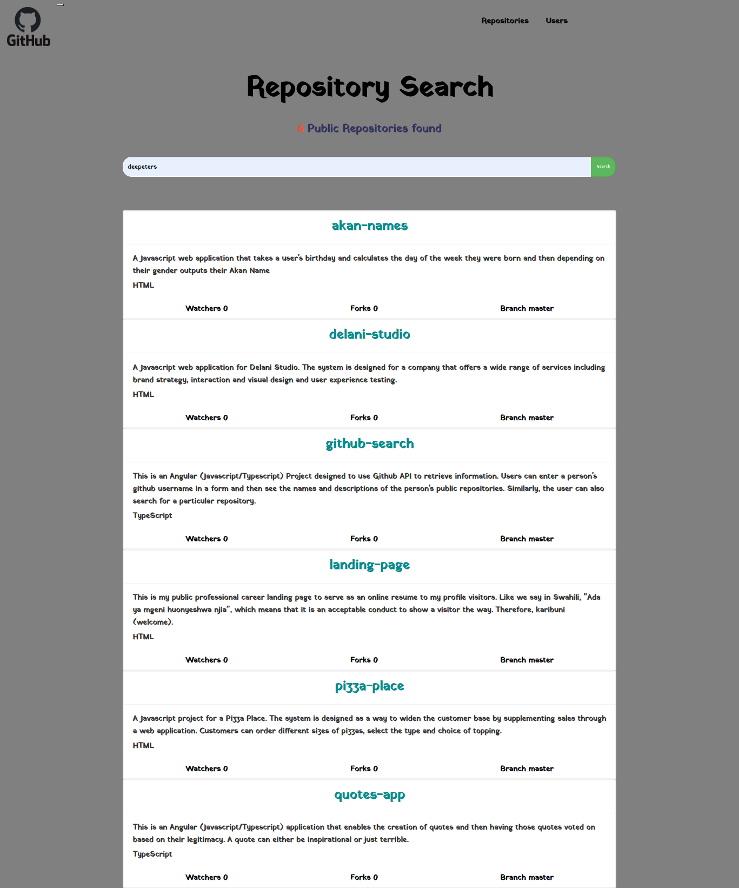

# Project Name: Github Search

### Project Description
This is an Angular (Javasript/Typescript) Project designed to use Github API to retrieve information. Users can enter a person's github username in a form and then see the names and descriptions of the the person's public repositories. Similarly, the user can also search for a particular repository. 

### Setup Instructions
The operations of the project are fairly straighforward. 
The application ia an Angular project and makes use of bootstrap as well as a custom CSS file.
Google Chrome is highly recommend to run the program.

* This website requires that you have data access to internet data.

# BDD

#| Inputs |  Description |
| :---         |          ---: |
| Username  | Github username, ``eg deepeters``|

| Outputs |  Description |
| :---         |          ---: |
| Profile data  | A specific user profile info.|
| Repositories   |  All repositories created by a user |

# Contact Infomation:
### Author: [DENNIS NJENGA](https://github.com/deepeters)

         Email: dennis@dennis.com
         Phone: +254712345678

### Technology Used
1. AngularJS
2. HTML
3. CSS
4. Javascript

### Frameworks Used
1. Git
2. Bootstrap
3. jQuery

### LICENSE: [MIT LICENSE](https://raw.githubusercontent.com/deepeters/github-search/master/LICENSE)